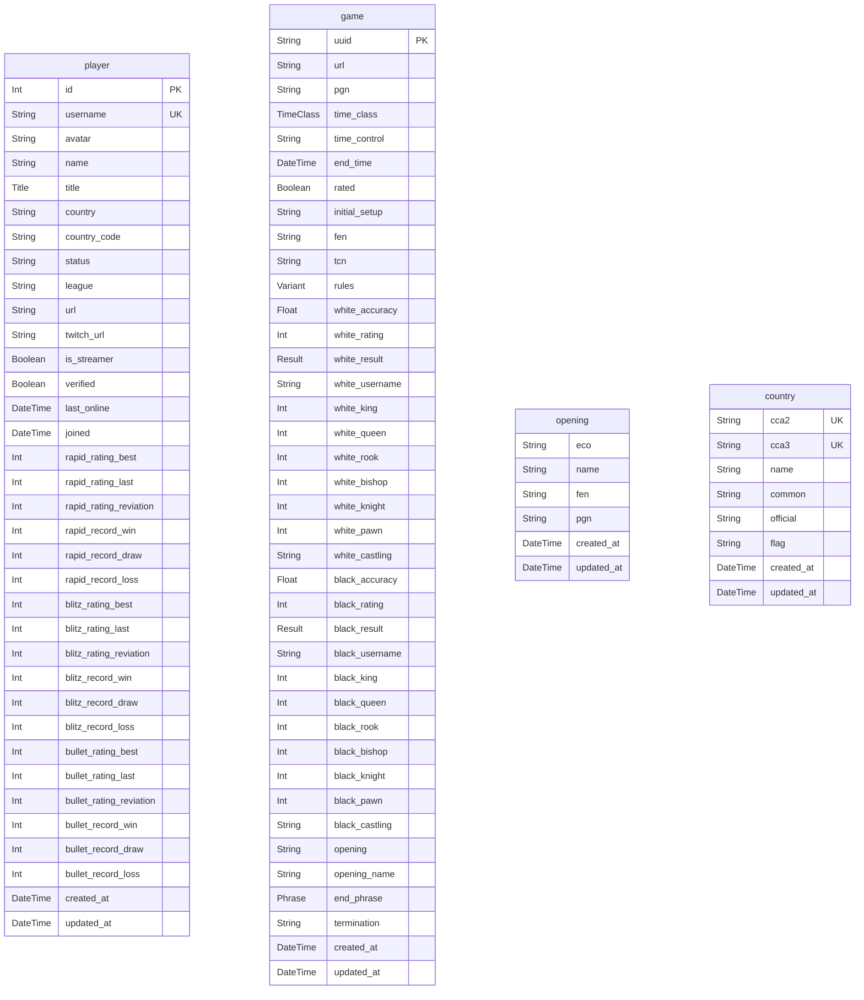

# Prisma Markdown
> Generated by [`prisma-markdown`](https://github.com/samchon/prisma-markdown)

- [default](#default)

## default

### `player`

**Properties**
  - `id`: 
  - `username`: 
  - `avatar`: 
  - `name`: 
  - `title`: 
  - `country`: 
  - `country_code`: 
  - `status`: 
  - `league`: 
  - `url`: 
  - `twitch_url`: 
  - `is_streamer`: 
  - `verified`: 
  - `last_online`: 
  - `joined`: 
  - `rapid_rating_best`: 
  - `rapid_rating_last`: 
  - `rapid_rating_reviation`: 
  - `rapid_record_win`: 
  - `rapid_record_draw`: 
  - `rapid_record_loss`: 
  - `blitz_rating_best`: 
  - `blitz_rating_last`: 
  - `blitz_rating_reviation`: 
  - `blitz_record_win`: 
  - `blitz_record_draw`: 
  - `blitz_record_loss`: 
  - `bullet_rating_best`: 
  - `bullet_rating_last`: 
  - `bullet_rating_reviation`: 
  - `bullet_record_win`: 
  - `bullet_record_draw`: 
  - `bullet_record_loss`: 
  - `created_at`: 
  - `updated_at`: 

### `game`

**Properties**
  - `uuid`: 
  - `url`: 
  - `pgn`: 
  - `time_class`: 
  - `time_control`: 
  - `end_time`: 
  - `rated`: 
  - `initial_setup`: 
  - `fen`: 
  - `tcn`: 
  - `rules`: 
  - `white_accuracy`: 
  - `white_rating`: 
  - `white_result`: 
  - `white_username`: 
  - `white_king`: 
  - `white_queen`: 
  - `white_rook`: 
  - `white_bishop`: 
  - `white_knight`: 
  - `white_pawn`: 
  - `white_castling`: 
  - `black_accuracy`: 
  - `black_rating`: 
  - `black_result`: 
  - `black_username`: 
  - `black_king`: 
  - `black_queen`: 
  - `black_rook`: 
  - `black_bishop`: 
  - `black_knight`: 
  - `black_pawn`: 
  - `black_castling`: 
  - `opening`: 
  - `opening_name`: 
  - `end_phrase`: 
  - `termination`: 
  - `created_at`: 
  - `updated_at`: 

### `opening`

**Properties**
  - `eco`: 
  - `name`: 
  - `fen`: 
  - `pgn`: 
  - `created_at`: 
  - `updated_at`: 

### `country`

**Properties**
  - `cca2`: 
  - `cca3`: 
  - `name`: 
  - `common`: 
  - `official`: 
  - `flag`: 
  - `created_at`: 
  - `updated_at`: 